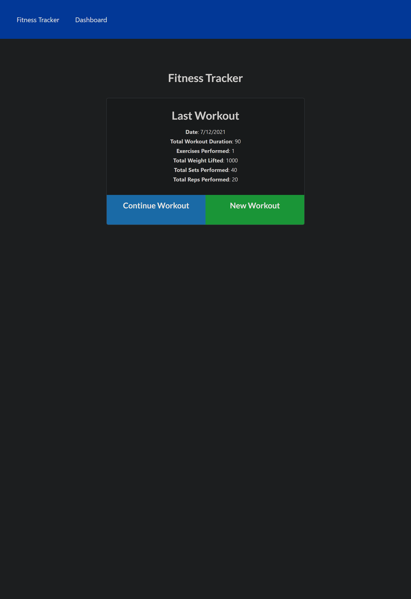
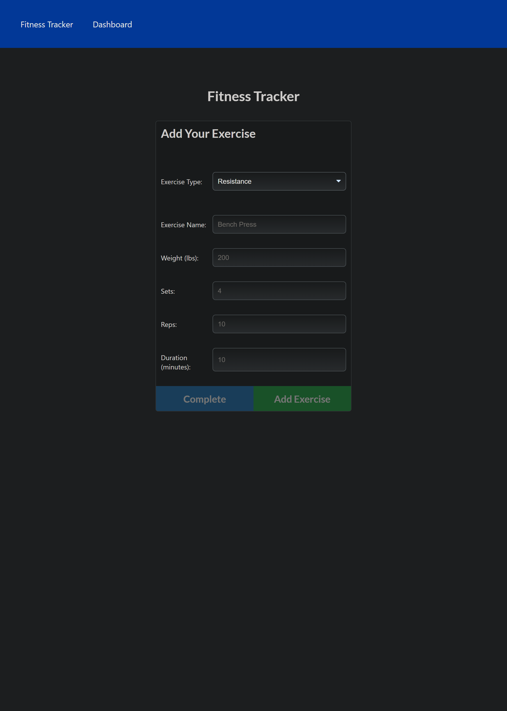
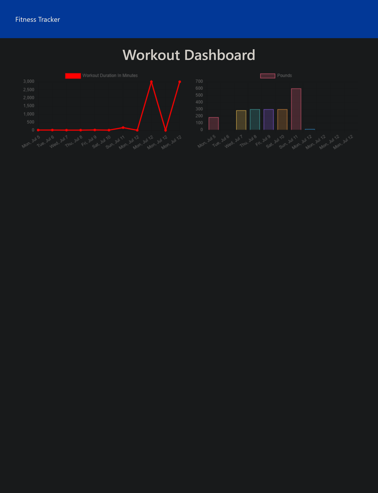

# 18-Nosql-Homework-Workout-Tracker

## Table of contents
- [Description](#description)
- [Link to Deployed Application](#link-to-deployed-application)
- [Screenshots](#screenshots)
- [Contact](#contact) 
- [License](#license)

## Description

 A workout tracker using a Mongo database with a Mongoose schema. Routes with Express.

 ##  Link to Deployed Application

 https://arcane-stream-48526.herokuapp.com/?id=60eccd742e749f00158abeda

 ## Screenshots

 

 

 

 ## Contact

### email

Dylan Cole <logboarddjc@gmail.com>

### Github 

https://github.com/Deucedadorian

## License
 
MIT License

Copyright (c) [2021] [Dylan Cole]